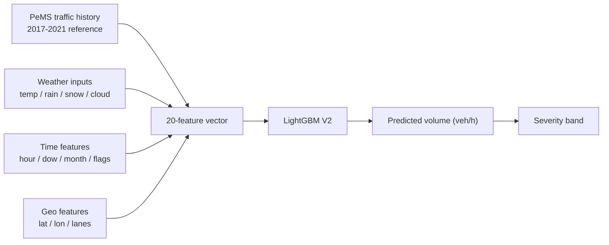

<p align="center">
  
</p>

IntelliTraffic predicts hourly traffic volume for a selected location and time by combining real
California PeMS sensor observations, historical weather, and a production LightGBM V2 model behind a
FastAPI backend and an interactive Vite + Leaflet map. Every value shown on the map is a real sensor
with a real model prediction, not a simulated point.

**Live Application:** https://www.intellitraffic.app/


---

<a id="project-lead"></a>


### Arham Hassan
*AI/ML & System Development*

Led the machine-learning pipeline, prediction architecture, backend integration, deployment workflow,
and overall technical direction of IntelliTraffic.

**Team**

- Alfia Fareed
- Darusha Javed
- Abu Alam Siddiqui

---

<a id="architecture"></a>




The system is a single linear pipeline: **Data → ML → API → Frontend → Map**. Real PeMS traffic and
historical weather are transformed into a 20-feature vector, scored by LightGBM V2, served through
FastAPI, and rendered by the Vite frontend as an interactive geospatial map of real sensor segments.

---

<a id="overview"></a>


IntelliTraffic turns real-world traffic data into location-aware predictions:

- **Real California PeMS traffic observations** (2017–2021 hourly sensor volumes) provide the
  historical traffic signal.
- **Historical weather** from the Open-Meteo archive is aligned to each sensor and time; at inference
  the caller supplies temperature, rain, snow, and cloudiness.
- **LightGBM V2** is the single production regression model used by every endpoint.
- **Geospatial sensor lookup** resolves a latitude/longitude request to the nearest real PeMS sensors.
- **FastAPI** exposes the prediction and traffic-map endpoints.
- **Vite frontend** (vanilla JavaScript) presents the controls and results.
- **Interactive map** (Leaflet + CARTO/OpenStreetMap tiles) draws the returned sensor segments.

The map segments correspond directly to **real PeMS sensor locations** and their **model predictions**.
No artificial road segments or fabricated traffic values are generated.

---

<a id="key-features"></a>


| Feature | Description |
| --- | --- |
| AI traffic-volume prediction | Hourly vehicles/hour estimate from the production LightGBM V2 model. |
| Real PeMS sensor data | Grounded in the California PeMS network (~8,600 sensors), not simulated traffic. |
| Geospatial sensor lookup | Resolves coordinates to the nearest real sensors within a 50 km support gate. |
| Historical weather integration | Weather variables are part of the training and inference feature set. |
| Interactive traffic map | Leaflet map renders nearby sensors as severity-coloured segments. |
| Traffic severity visualization | Predictions are banded into LOW / MODERATE / HIGH / SEVERE. |
| Cloud deployment | Frontend and backend are deployed on Azure and served over HTTPS. |

---

<a id="ai-ml-pipeline"></a>


The production model is a **LightGBM V2** gradient-boosted regressor, loaded at runtime from
`models/traffic_lightgbm_v2.txt`. A single feature builder produces the exact input vector for both the
`/predict` and `/traffic-map` endpoints.



<details>
<summary>View as Mermaid diagram</summary>



</details>

### Production feature set

The model consumes the following 20 features, in order (see `src/prediction_features.py`):

```text
traffic
hour
day_of_week
month
is_weekend
is_rush_hour
traffic_lag_1
traffic_lag_2
traffic_lag_3
traffic_lag_24
traffic_lag_168
rolling_mean_3
rolling_mean_24
latitude
longitude
lanes
temperature
rain
snow
cloudiness
```

- **Lag features** capture recent and periodic traffic: `traffic_lag_1/2/3` are the previous three
  hours, `traffic_lag_24` is the same hour one day earlier, and `traffic_lag_168` is the same hour one
  week earlier.
- **Rolling features** smooth short-term noise: `rolling_mean_3` averages the last 3 hours and
  `rolling_mean_24` the last 24 hours.
- Lag and rolling values are read from real PeMS history ending at the mapped historical reference
  time (see [Historical Prediction Mapping](#historical-prediction-mapping)).

Predicted volumes are classified into severity bands calibrated to the model's observed output range
(0–993 vehicles/hour):

| Band | Predicted volume (veh/h) |
| --- | --- |
| LOW | `< 200` |
| MODERATE | `200 – 399` |
| HIGH | `400 – 599` |
| SEVERE | `>= 600` |

---

<a id="geospatial-intelligence"></a>




IntelliTraffic resolves requests against the real California PeMS sensor network rather than generating
map points.

- **~8,600 California PeMS sensors** are loaded from `data/raw/largest/ca_meta.csv`.
- Each sensor carries **latitude/longitude** plus district, county, freeway, lanes, type, and direction.
- A haversine (great-circle) distance finds the **nearest sensors** to a requested coordinate.
- `/predict` uses the single nearest sensor; `/traffic-map` uses **up to 8 nearby sensors**, sorted
  nearest-first, for map visualization.
- A **50 km support gate** rejects locations farther than 50 km from any PeMS sensor before the model
  runs, so predictions never silently map onto an unrelated sensor.

Coverage is limited to the California PeMS network. IntelliTraffic does **not** claim global traffic
coverage.

---

---

<a id="technology-stack"></a>


Versions reflect `requirements.txt`, `frontend/package.json`, and the `Dockerfile`.

| Layer | Technology |
| --- | --- |
| Language / Runtime | Python 3.11 |
| Machine Learning | LightGBM 4.7, scikit-learn 1.5 (metrics), pandas 2.2, NumPy 2.1, pyarrow 18.1, joblib 1.4 |
| Backend / API | FastAPI 0.115, Uvicorn 0.30, Pydantic 2.9, httpx 0.27 |
| Frontend | Vite 6, vanilla JavaScript (ES modules), HTML/CSS, Tailwind CSS (CDN) |
| Maps | Leaflet 1.9.4 with CARTO basemaps (OpenStreetMap) |
| Weather data | Open-Meteo historical archive API |
| Traffic data | California PeMS |
| Testing / Quality | pytest, Ruff |
| Containerization | Docker (`python:3.11-slim`) |
| Cloud | Azure Static Web Apps, Azure Container Apps, Azure Container Registry |

---

<a id="repository-structure"></a>




<details>
<summary>View as plain text</summary>

```text
traffic-prediction-system/
├── .github/workflows/ci.yml              # Ruff + pytest + compileall (Python 3.11)
├── docs/assets/
│   └── intellitraffic-architecture.svg   # Animated README hero visual
├── frontend/                             # Vite + vanilla JS app (Leaflet map)
│   ├── index.html
│   ├── src/
│   ├── package.json
│   └── vite.config.js
├── models/
│   ├── traffic_lightgbm_v2.txt           # Production model (used at runtime)
│   ├── traffic_lightgbm.txt              # Earlier training lineage
│   └── traffic_lightgbm_continuous.txt   # Earlier training lineage
├── notebooks/                            # Exploration / cleaning / feature engineering
├── scripts/                              # Data prep, feature build, training, validation
├── src/                                  # FastAPI backend
│   ├── main.py                           # App, CORS, /predict, /traffic-map
│   ├── prediction.py                     # LightGBM V2 inference
│   ├── prediction_features.py            # 20-feature vector builder
│   ├── traffic_history.py                # PeMS hourly history loader
│   ├── history_time.py                   # 2026-2030 -> 2017-2021 mapping
│   ├── sensor_lookup.py                  # Geospatial PeMS sensor resolution
│   └── severity.py                       # Severity bands
├── tests/
│   ├── test_api.py                       # Endpoint + geospatial gate tests
│   └── test_year_mapping.py              # Year-mapping + severity tests
├── data/                                 # Raw + processed datasets (Git-ignored)
├── Dockerfile
├── requirements.txt
├── pyproject.toml
└── README.md
```

</details>

Large raw/processed datasets under `data/` are excluded from Git (see [Security](#security)). The
runtime still requires `models/traffic_lightgbm_v2.txt`, `data/raw/largest/ca_meta.csv`, and the
hourly Parquet files under `data/processed/hourly/`.

---

<a id="api"></a>


The FastAPI backend exposes the prediction surface below. Interactive Swagger/ReDoc/OpenAPI
documentation is intentionally **disabled in production**.



| Method | Endpoint | Purpose |
| --- | --- | --- |
| `GET` | `/` | Service status and model name |
| `POST` | `/predict` | Predict traffic volume for a location and time |
| `POST` | `/traffic-map` | Predict the nearby real PeMS sensor segments |
| `GET` | `/debug/cors` | Diagnostic view of the active CORS allow-list |

### `POST /predict`

Request body:

```json
{
  "latitude": 38.5816,
  "longitude": -121.4944,
  "date_time": "2026-10-07T18:00:00",
  "day_type": "Weekday",
  "temperature": 25,
  "rain": 0,
  "snow": 0,
  "cloudiness": 20
}
```

| Field | Type | Description |
| --- | --- | --- |
| `latitude` / `longitude` | float | Requested location; resolved to the nearest PeMS sensor. |
| `date_time` | string | Requested prediction timestamp (must fall in 2026–2030). |
| `day_type` | string | `Weekday` or `Weekend`; must match the selected date. |
| `temperature` | float | Temperature input for the weather features. |
| `rain` | float | Rainfall input. |
| `snow` | float | Snowfall input. |
| `cloudiness` | float | Cloud cover input. |

The response includes the `prediction` (vehicles/hour), the requested `prediction_time`, the mapped
`historical_reference_time`, the `severity` band, the resolved `sensor` (id, coordinates, distance,
district, county, freeway, lanes, type, direction), the echoed `weather_input`, and the derived
`day_type`.

Requests are validated before the model runs: an inconsistent `day_type`, a date outside 2026–2030, or
a location more than 50 km from any PeMS sensor returns `400`; a malformed or missing body returns
`422`.

### `POST /traffic-map`

Accepts the same request body and applies the same validation, historical mapping, geographic gate,
and LightGBM V2 model. It returns up to 8 nearby sensors as `segments` (each with real sensor metadata,
`prediction`, and `severity`), plus `prediction_time`, `historical_reference_time`, `day_type`,
`location`, and an `errors` list for any sensor whose history is unavailable.

---

<a id="local-development"></a>


### Backend

```powershell
cd C:\PROJECTS\IntelliTraffic\traffic-prediction-system
python -m venv .venv
.venv\Scripts\Activate.ps1
pip install -r requirements.txt
uvicorn src.main:app --reload
```

The API runs at `http://127.0.0.1:8000`. Run from the repository root so the relative model and data
paths resolve. Local runs require `models/traffic_lightgbm_v2.txt`, `data/raw/largest/ca_meta.csv`,
and the hourly Parquet files under `data/processed/hourly/` (these datasets are not committed to Git).

### Frontend

```powershell
cd frontend
npm install
npm run dev
```

The Vite dev server runs at `http://localhost:5173`. Copy `frontend/.env.example` to a local env file
and set `VITE_API_BASE_URL` (backend URL) and, for map tiles, `VITE_CARTO_API_KEY`.

---

<a id="testing"></a>




Run the suite from the repository root:

```powershell
pytest
```

- `tests/test_api.py` — endpoint behaviour, 2026→2017 / 2030→2021 mapping through the API, day-type
  validation, the geographic gate (out-of-region locations are rejected before the model runs), and the
  50 km support boundary.
- `tests/test_year_mapping.py` — deterministic year mapping, leap-day clamping, prediction-window
  validation, and severity thresholds.

Continuous integration (`.github/workflows/ci.yml`) runs on pushes and pull requests to `main` and
`dev`, and on manual dispatch. Each run installs `requirements.txt`, then executes **Ruff** linting
(`ruff check .`), **pytest** (`pytest tests/`), and a syntax check (`python -m compileall src/ tests/`)
on Python 3.11. No coverage threshold is configured or claimed.

---

<a id="docker"></a>




The backend is containerized from `python:3.11-slim`. The image installs `libgomp1` (the LightGBM
native runtime dependency) and the pinned Python requirements, then bundles the production model and
the runtime data it needs.

```powershell
docker build -t intellitraffic-api .
docker run -p 8000:8000 intellitraffic-api
```

The container copies `src/`, the production model `models/traffic_lightgbm_v2.txt`, the sensor metadata
`data/raw/largest/ca_meta.csv`, and the hourly Parquet store `data/processed/hourly/`, exposes port
`8000`, and starts with `uvicorn src.main:app --host 0.0.0.0 --port 8000`.

---

<a id="azure-deployment"></a>


The production deployment separates the static frontend from the containerized backend:



<details>
<summary>View as plain text</summary>

```text
Azure Static Web Apps   (frontend)
        |
        v
Azure Container Apps    (FastAPI backend)
        ^
        |
Azure Container Registry (backend image)
```

</details>

- **Azure Static Web Apps** hosts the built Vite frontend and serves it over HTTPS at
  `https://www.intellitraffic.app/`.
- **Azure Container Apps** runs the FastAPI backend as a managed container that the frontend calls
  cross-origin over HTTPS.
- **Azure Container Registry** stores the backend Docker image that Container Apps pulls on deploy.

Allowed frontend origins are configured through the `ALLOWED_ORIGINS` environment variable. No
credentials, subscription IDs, tokens, or secrets are stored in the repository.

---

<a id="security"></a>


Verified practices in this repository:

- Environment files are ignored: `.env`, `.env.*`, and `*.local` are excluded by `.gitignore`, while
  `.env.example` is intentionally tracked as a safe configuration template.
- No credentials are committed; the CARTO basemap key is supplied at build time via
  `VITE_CARTO_API_KEY` and is not hardcoded in source.
- Production API documentation is disabled (`docs_url`, `redoc_url`, and `openapi_url` are `None`).
- CORS uses an explicit allow-list read from `ALLOWED_ORIGINS` (never `*`) with
  `allow_credentials=False`.
- Large datasets and trained binaries are excluded from Git: `data/raw/`, `data/processed/`,
  `*.parquet`, `*.csv.gz`, and `*.pkl`. The runtime LightGBM V2 model is a plain-text `.txt` file.

---

<a id="limitations"></a>


- The model is trained on the **California PeMS** network; it is **not** a global traffic predictor.
- The underlying observations are **historical (2017–2021)**.
- **2026–2030** requests are mapped onto historical years; they are not real future observations.
- Outputs are **model estimates**, not live traffic measurements.
- There is **no live/real-time traffic feed**: weather is supplied by the caller at inference, and
  historical weather (Open-Meteo) was used during training.
- Locations more than **50 km** from a PeMS sensor are rejected by design.

---

<a id="future-improvements"></a>


- Live traffic feeds and real-time sensor ingestion
- Broader and more diverse geographic datasets
- Event / incident data integration
- Route-level travel-time prediction
- Uncertainty estimation for predictions
- Model monitoring and drift detection
- Automated retraining pipelines
- Expanded geographic coverage

These are directions for future work and are not implemented features.

---

<a id="project-status"></a>


IntelliTraffic is **deployed and functional**. The frontend is live at https://www.intellitraffic.app/,
the FastAPI backend serves predictions from the LightGBM V2 model, and CI runs on the `main` and `dev`
branches.

---

<a id="credits"></a>


**Project Lead:** Arham Hassan

**Team:**

- Alfia Fareed
- Darusha Javed
- Abu Alam Siddiqui

---

<a id="license"></a>


No license file is currently included in this repository. IntelliTraffic is maintained as an
**academic / portfolio project**; no open-source license has been applied yet.
